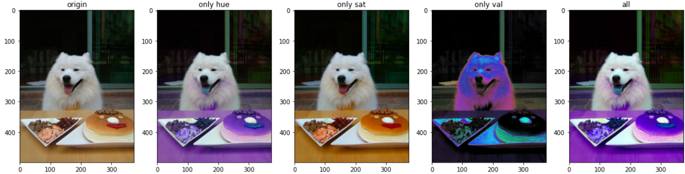
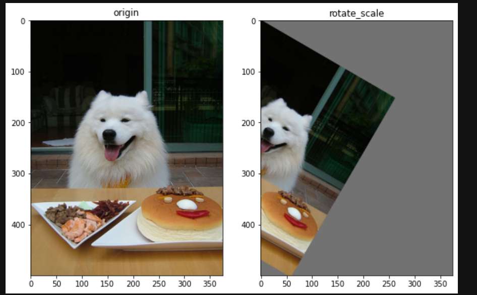
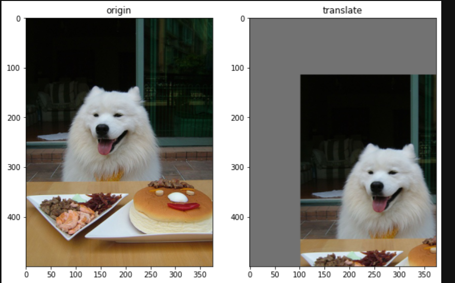

# 13周总结（11.20-11.26）

本周主要是围绕了detect中的任务开展的
## 1. 训练数据集并进行检测
就是正常的打标和预测
## 2. 观看推荐的视频
其中关于这个视频，着重观看了关于yolov5中自带的数据增强的类，并进行了相应的注释。在我看来，进行了一些总结（不知道对不对哈，个人看法），就是在进行训练的时候，yolov5会对我们的数据集进行一下的一些操作：
   1. 将图像进行统计的裁剪
   2. 自带的数据增强，例如：
      1. HSV 变换：调整色调，调整饱和度，曝光调整等
     
      2. 旋转缩放
        
      3. 平移
       
      等一系列的操作，来将数据集翻倍

## 关于昨日的讨论，个人的一些看法
1. 就是其中大家提到了提高精度第一个方法，就是通过堆数据集的数量来得到相应的精度提升，所以，我觉得在今后，咱们重新制作一个数据集，就从：正面（曝光，正常，暗光），倾斜角度（75，60，45，15+上下左右+曝光，正常，暗光）。可以先测试一下咱们这个比较精准的数据集，来看看能否在倾斜，强弱光的情况下检测到，如果可以，就直接采用用数据集的量来堆精度这个方法。
2. 其次就关于神经网络的学习，感觉还是很有必要的，可以不要求的太深，但是懂得一些基本的概念就可以

  